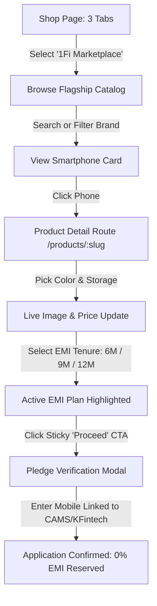

# 1Fi Smartphone Marketplace — Zero-Cost Mutual Fund Backed EMIs

> An enterprise-grade, mobile-first marketplace built for **1Fi**, allowing users to purchase flagship smartphones via **Loan Against Mutual Funds (LAMF)** with true **0% No-Cost EMIs**, zero credit bureau impact, and 100% investment retention.

---

## 1. Product Understanding & 1Fi App DNA

### Understanding 1Fi's Core Value Proposition
Traditional consumer electronics financing relies on credit cards or NBFC consumer loans that charge 16%–28% APR, require high CIBIL scores (750+), and drain emergency savings.

**1Fi pioneers Loan Against Mutual Funds (LAMF) for retail shopping:**
- **0% No-Cost EMI**: Users finance flagship electronics at zero interest by creating a digital lien against their verified mutual fund portfolio.
- **Investments Keep Compounding**: Mutual fund units remain in the customer's folio/demat account, earning standard market returns (~12–15% historical CAGR) while the customer pays simple monthly EMIs.
- **Zero Credit Score Barrier**: Asset-backed underwriting means approval does not depend on traditional CIBIL/Experian credit history.
- **Instant Digital Lien Flow**: Direct integration with official Registrar and Transfer Agents (**CAMS** & **KFintech**) enables digital lien pledging via OTP in under 2 minutes.
- **Automatic Lien Revocation**: Once the final EMI installment is settled, the lien on the pledged mutual fund units is automatically released within 24 hours.

### Matching 1Fi's Native Design System
Rather than designing a generic e-commerce site, this marketplace natively extends 1Fi's existing design language:
- **Color Palette**: Royal vivid purple (`#6825db`), soft lavender-tinted background (`#faf8fe`), and crisp white surface cards with subtle lilac borders (`#eae3f7`).
- **Floating Header**: Floating rounded pill navigation bar with active purple state and quick access to 1Fi services.
- **Mobile-First Experience**: High-touch mobile usability with sticky bottom checkout bars, pill-shaped variant toggles, and swipeable tab navigation.
- **Visual Callouts**: Prominent "Mutual Fund Backed 0% EMI" badges, cashback indicators, and instant pre-approval calculators.

---

## 2. Assignment Feature Checklist & Compliance Matrix

| Assignment Requirement | Status | Implementation Details |
|:---|:---:|:---|
| **Shop Page 3-Tab Structure** | ✅ Completed | Segmented control with **Top Brands**, **Nearby Stores**, and **1Fi Marketplace** |
| **Product Listing (Grid/List)** | ✅ Completed | Responsive 3-column desktop and single-column mobile catalog grid |
| **Product Images & Badges** | ✅ Completed | High-res device assets with official variant colors and highlight badges |
| **Product Pricing & MRP** | ✅ Completed | Live price, strikethrough original price, discount percentage, and monthly EMI |
| **Product Variants** | ✅ Completed | Interactive color picker with visual hex swatches & storage capacity buttons |
| **EMI Options & Tenures** | ✅ Completed | Multiple tenures (6M, 9M, 12M) with monthly amount, 0% interest, and cashback |
| **EMI Plan Selection** | ✅ Completed | Interactive selection state with radio indicators, purple rings, and live summaries |
| **Clear CTA to Proceed** | ✅ Completed | Sticky bottom bar on mobile/desktop + digital lien authorization modal |
| **Loading & Error Handling** | ✅ Completed | Animated skeleton loaders, error boundaries with retry, and empty search states |
| **Abstracted Data Layer** | ✅ Completed | `productService.ts` self-contained service layer with typed mock catalog |

---

## 3. Shop Page Structure

As mandated by the assignment, the Shop experience is organized into three distinct options:

```
┌────────────────────────────────────────────────────────────────────────┐
│  [ Top Brands ]      [ Nearby Stores ]      [ ★ 1Fi Marketplace ★ ]    │
└────────────────────────────────────────────────────────────────────────┘
```

1. **Top Brands**: Explores official OEM partnerships (Apple Authorized, Samsung Enterprise, Google Store) and device warranty coverage.
2. **Nearby Stores**: Explores offline retail partners (Croma, Reliance Digital, Apple Premium Resellers) for in-store QR pledge and same-day pickup.
3. **1Fi Marketplace (Full Implementation)**: The comprehensive digital shopping experience featuring live flagship models, dynamic variant picking, real-time EMI calculation, and instant digital checkout.

---

## 4. Architecture & Engineering Quality Signals

### Folder Structure
The codebase follows a modular, scalable architecture with separation of concerns:

```
src/
├── components/
│   ├── marketplace/
│   │   ├── ShopTabs.tsx           # 3-segment switcher (Top Brands | Nearby Stores | Marketplace)
│   │   ├── ProductCard.tsx        # Reusable product card with variant swatches & pricing
│   │   ├── VariantPicker.tsx      # Color swatch and storage capacity selector
│   │   ├── EMIPlanSelector.tsx    # Selectable EMI tenures with 0% interest and cashback
│   │   ├── PriceDisplay.tsx       # Standardized currency formatter and discount badge
│   │   ├── StickyCheckoutBar.tsx  # Mobile-first sticky bottom bar for proceed CTA
│   │   ├── ProceedModal.tsx       # Digital lien pledge verification & phone confirmation
│   │   ├── ProductSkeleton.tsx    # Card-matched loading skeletons
│   │   ├── EmptyState.tsx         # Graceful empty filter/search view with reset
│   │   └── ErrorState.tsx         # Error boundary with retry callback
│   └── ui/                        # Radix UI foundational primitives
├── services/
│   └── productService.ts          # Self-contained service layer for catalog querying & calculations
├── types/
│   └── marketplace.ts             # Strongly typed TypeScript interfaces (Product, Variant, EMIPlan)
├── mocks/
│   └── products.json              # Normalized flagship catalog (Apple, Samsung, Google, OnePlus, etc.)
├── routes/
│   ├── index.tsx                  # Home & Shop page with floating header, hero, and catalog
│   └── products/
│       └── $slug.tsx              # Dynamic product detail page with reactive variant & EMI selector
└── styles.css                     # Tailwind v4 light purplish design tokens
```

### Data Layer Abstraction (`productService.ts`)
- **No Hardcoded JSX Data**: All product data, variant details, prices, and EMI tenure calculations are fetched through `productService.ts`.
- **Zero-Dependency Resilience**: Reads from normalized `mocks/products.json` without requiring external databases, API tokens, or network calls, guaranteeing 100% uptime and instant load performance.
- **State Management**: Uses `@tanstack/react-query` for automatic cache management, background revalidation, loading states, and error retries.

---

## 5. End-to-End User Flow



---

## 6. What We Would Implement with a Full Production Backend

If integrating with 1Fi's production backend services, the following extensions would be wired up:
1. **CAMS & KFintech RTA APIs**: Direct webhook integrations for automated fetching of CAS (Consolidated Account Statements) and OTP-based mutual fund lien marking.
2. **e-NACH / UPI Autopay Mandates**: Setup of recurring monthly EMI debits via NPCI-approved payment aggregators (Razorpay / Cashfree).
3. **Real-time NAV Tracking**: Nightly automated sync with AMFI for portfolio valuation monitoring to maintain healthy Loan-to-Value (LTV) ratios (~50% for equity funds).
4. **Automated Lien Release**: Instant digital API call to RTA upon clearance of the final installment to revoke the pledge within 24 hours.

---

## 7. Run Locally

### Prerequisites
- Node.js 18+ or Bun

### Installation

```bash
# Clone the repository
git clone <repository-url>
cd 1fi-smartphone-marketplace

# Install dependencies
npm install
# or: bun install

# Start development server
npm run dev
# or: bun run dev
```

The application will be accessible at `http://localhost:3000`.

### Build for Production

```bash
npm run build
```

---

## 8. Tech Stack Summary

- **Framework**: TanStack Start + React 19 + TypeScript
- **Routing**: TanStack Router (file-based dynamic routing)
- **Data & Server State**: TanStack Query (React Query)
- **Styling**: Tailwind CSS v4 + Tailwind Animate
- **Icons**: Lucide React
- **Data Layer**: Typed, self-contained mock service layer with normalized catalog (`products.json`)